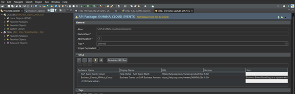
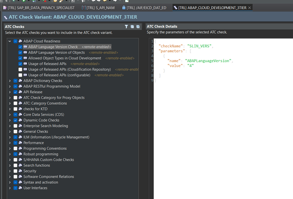
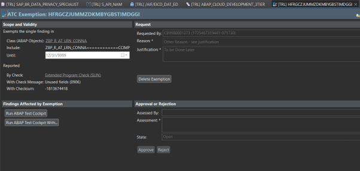
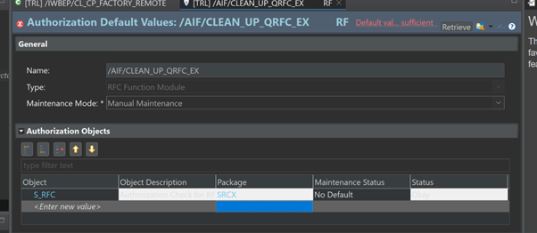
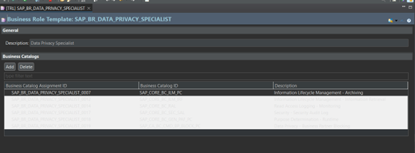
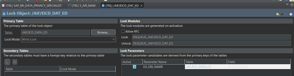
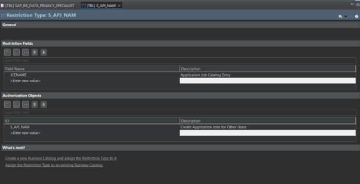
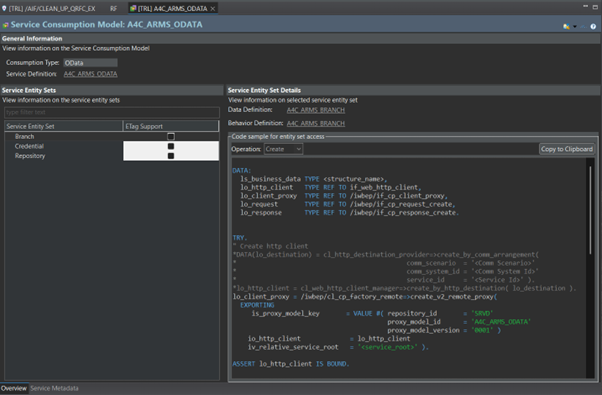

# Known default Eclipse / ADT / Windows 11 Issues

There are known problems using the eclipse Dark Theme with ADT, what You face without using this tool anyway.

**Please do not open issues about them, we are neither causing them nor in the position to fix those.**

Below You find the list about such issues on Windows 11 (>23H2) / Dark color mode. Frankly neither the ADT nor Eclipse Dev teams can be blamed for that, but rather **big respect!** Things are really complicated in the background. Some parts coming very far from dll files and windows, SWT, custom plugins which trying to catch up with CSS files. At least from GuitHub issues visited w/o being an e4 or Java expert this was the consequence. Not a playground for children 💯👈.

*Just an example on a compuer with nvidia Graphics with latest Win 11 version: colored areas are rendered with light colors in Eclipse/ADT, but when we do a screenshot about the issue, the right color is shown in snipping tool 👻. The same theme and styles on different computer with older windows causes no trouble, just to make things more complicated. The boundaries are far away of this little patch tool even to analyze and understand it.*

Majority of issues is the same, You see unexpected white highlight / background which makes the text impossible to read. The

## API Package - SOD1

## ATC Check Variant - CHKV

# ATC Exemption - CHKE

## Authorization Default Values - SUSH

## Business Role Template - SIA8

## Lock Object - ENQU

## Restriction Type - SIA2

## Service Consumption Model - SRVC

