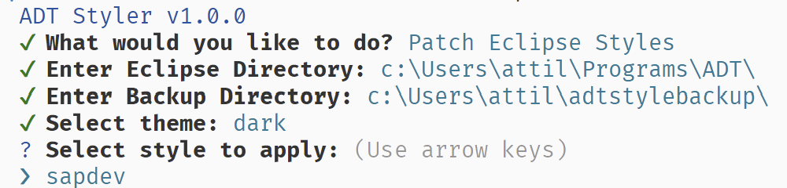
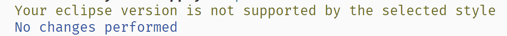
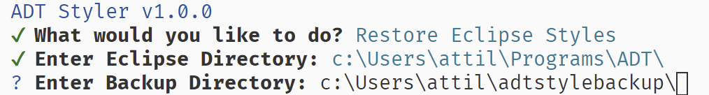
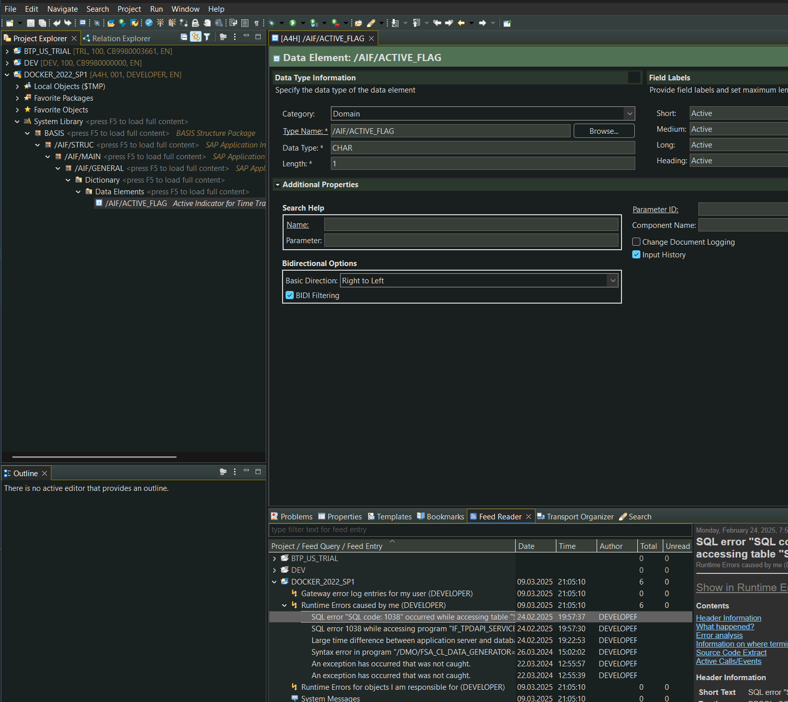
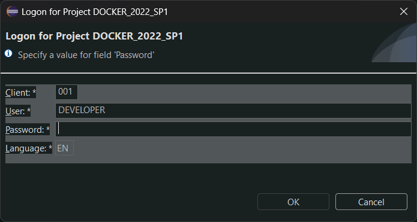

# ADT Styler

A command-line tool for ABAP Development Tool (ADT) styling. Patches the Dark and Light theme of eclipse with the selected color style on Windows.

*At the moment You have one style called sapdev for the Dark theme available. Long term plans here, so more will come slowly but tested thoroughly. Expect next a Light style.*

## Motivation

3rd party themes and plugins which inject themself into Eclipse caused unstability and slowdown. Plenty of error messages appear continously in the Eclipse log view using ADT. Things were even worse working on remote environments. Good we have few of such genric plugins, but there is a point were things start to be uncomfortable and unusable. This whole little project started with adjusting a single color within a single file, due the selection highlight wasn't really spottable in the eclipse project explorer using the dark theme. After this maniac little devil 🙉  appear and wanted more. Here we are 🙋. Things can be made better looking always. There is no end in Eclipse styling, even minor issues / side-effects acceptable, right ? 😅

## Installation

Prerequsite is [Node.js](https://nodejs.org/), Windows.

```bash
npm install -g @sapdev.eu/adtstyler
```

*For the first time you might get an error that executing scripts is disabled on your computer . Please issue this command and answer Y-Yes within PowerShell started as Administrator.*

```sql
Set-ExecutionPolicy -Scope CurrentUser -ExecutionPolicy Unrestricted
```

## Change Log

[Change Log](CHANGELOG.md)

## Usage

### Applying color styles

* Close all tabs, then Eclipse. *Optional: backup your eclipse folder.*
* Issue the following command in terminal:

```bash
adtstyler
```

* Select : Patch Eclipse Styles
* Enter Eclipse installation directory to be patched
* Enter a backup directory what your user has permission to write. *This folder will be used to backup the files we patch. Remember this folder, it will be needed to restore the original styles in case You do not like what You see. 👽 👀*



Bad luck receiving the following, because that means the style is not supporting Your version of Eclipse.



Please look at the Styles section whether the given style suppports your eclipse version.

### Restoring your theme

In case You do not like the results, or You want to apply another style, then You need to restore the original eclipse files from your backup folder what You specified above. If You do not have the backup folder anymore for some reason, here is the [failsafe recover instruction](failsafe_recovery.md).



## Styles

### Dark

| Name             | Supported Version / Build         | OS         | About           |
| ---------------- | --------------------------------- | ---------- | --------------- |
| **sapdev** | 2024-12 (4.34.0) / 20241128-0757 | Windows 11 | Darker, Greener |

## Submitting issues

### DON'TS

There are known problems using the eclipse Dark Theme with ADT, what You face without using this tool anyway.

[List](3rd_party_issues.md) of such issues on Windows 11 (>23H2) / Dark color mode.

**Please do not open issues about them, we are neither causing them nor in the position to fix those.**

### DOS

Many objects were tested successfully, but new type of workbench object may arise or new parts came appear.

To start the investigation please post the issue with title like this: **DTEL - Data Element**

Please include the following details

* a SAP standard workbench object name to reproduce the issue
* screenshot about the problem
* eclipse version including build version: Help -> About Eclipse IDE
* windows version and build

## Shots and Test Results

### Dark Styles

#### sapdev

Note: to be in full harmony with this theme, You can apply some manual tweaks also: [https://www.sapdev.eu/abap-developer-tools-the-fine-tuning/](https://www.sapdev.eu/abap-developer-tools-the-fine-tuning/). *Reset manual tweaks when switching to a Light style.*

Tests were executed on an isolated VM environment with an untouched Eclipse installation.

System Version Windows 11 24H2



Following plugins were tested successfully

* abapGit
* ABAP Favorites

Following non-source code based Workbench Objects were tested successfully.

| Type | Name                                                    |
| ---- | ------------------------------------------------------- |
| AOBJ | Archiving Object                                        |
| APLO | Application Log Object                                  |
| AUTH | Authorization Field                                     |
| ENHS | Enhancement Spot                                        |
| BADI | BAdI                                                    |
| CDBO | Customer Data Browser Object                            |
| CFDF | Custom Field                                            |
| CHDO | Change Document Object                                  |
| CHKC | ATC Check Category                                      |
| CHKO | ATC Check                                               |
| COTA | Communication Target                                    |
| DDLV | CDS Variant                                             |
| DESD | Logical External Schema                                 |
| DEVC | Package                                                 |
| DOBJ | Data Destruction Object                                 |
| DOMA | Domain                                                  |
| DSFI | Scalar Function Implementation Reference                |
| DTEL | Data Element                                            |
| DTF1 | Date Function                                           |
| EEEC | Event Consumption Model                                 |
| ENQU | Lock Object                                             |
| EVTB | Event Binding                                           |
| GSMP | Metric Provider                                         |
| HTTP | HTTP Service                                            |
| MSAG | Message Class                                           |
| NONT | SAP Object Node Type                                    |
| NROB | Number Range Object                                     |
| NTTA | Note Type Assignment                                    |
| NTTY | Note Type                                               |
| PARA | SET/GET Parameter                                       |
| PINF | ABAP Package Interface                                  |
| PRAG | ABAP Pragma                                             |
| RONT | SAP Object Type                                         |
| SAJC | Application Job Catalog Entry                           |
| SAJT | Application Job Template                                |
| SCO1 | Communication Scenario                                  |
| SCO2 | Inbound Service                                         |
| SCO3 | Outbound Service                                        |
| SHLP | Search Help                                             |
| SIA1 | Business Catalog                                        |
| SIA3 | Authorization Object Extension                          |
| SIA5 | Restriction Field                                       |
| SIA6 | IAM App                                                 |
| SIA7 | Business Catalog App Assignment                         |
| SIA9 | IAM Business Role Template Catalog Assignment           |
| SIAD | Business Role Templ.- Launchpad Space Templ. Assignment |
| SICF | ICF Endpoint                                            |
| SKTD | Knowledge Transfer Document                             |
| SMBC | Business Configuration Maintenance Object               |
| SOD2 | API Package Assignment                                  |
| SPRV | SOAP Provider Model                                     |
| SRVB | Service Binding                                         |
| SUSI | Authorization Default (External)                        |
| TTYP | Table Type                                              |
| UIAD | Launchpad App Descriptor Item                           |
| UIPG | Launchpad Page Template                                 |
| UIST | Launchpad Space Template                                |
| VIEW | Dictionary View                                         |
| WDCA | Web Dynpro Application Configuration                    |
| WDCC | Web Dynpro Component Configuration                      |
| WDCP | Web Dynpro Chip                                         |
| WDYA | Web Dynpro Application                                  |
| WDYN | Web Dynpro Component                                    |

## Known issues

The system logon screen is a custom ADT composite dialog. Style is not picked up completely:



## License

[License](LICENSE "Read carefully")
