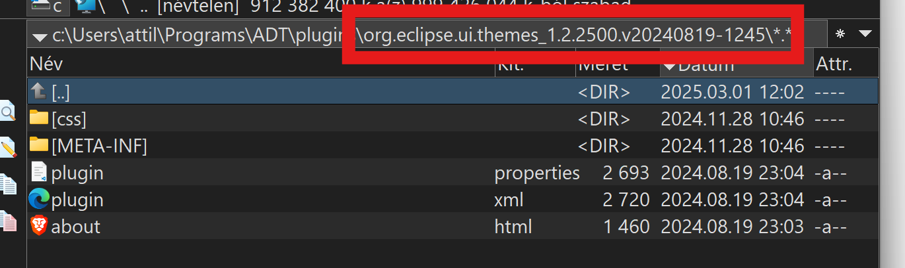

# Whoopsie

Bad things happen...

To restore your corrupted eclipse installation do the following:

* close Eclipse
* make a copy of your corrupted eclipse folder, just in case...
* download the same eclipse version you own from https://www.eclipse.org as zip
* unpack the zip and open the plugins folder
* ensure the version of the UI plugin is the same as in your eclipse installation, otherwise You will make things even worse
* 
* copy the content of the **css** folder from the downloaded version ➡️ into your eclipse installations css folder,You can overwrite when prompted
* start eclipse with `eclipse -clean command`
